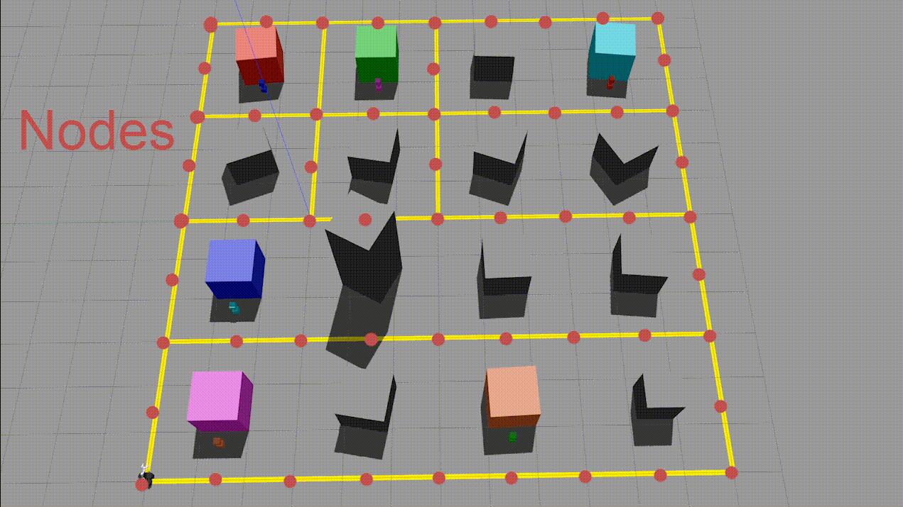

# Duck Express
## Project Description
The DuckExpress robot drives around a neighborhood of colored houses and delivers packages (dumbbells) to and from the houses. The goal of this project was to create a robot that could 1) create paths for itself in a dynamic and optimal way and 2) utilize exploitation versus exploration algorithms to gradually explore the world around it, making choices about the best packages to deliver or the best house to check. 

Our robot can pick up and deliver packages to the correct destination. Each package is a colored dumbbell and must be delivered to the house of the same color. The robot can successfully grab the package, plot the shortest course to the destination, and deliver the package there. We unfortunately were not able to implement a sophisticated scheduling algorithm, and so currently DuckExpress moves through a preset list of houses and delivers the package from each house to its destination. However, even this last part is not fully tested. We were not able to get DuckExpress to deliver every package in the neighborhood in a single run. Our demo shows DuckExpress picking up the cyan package from the blue house, calculating a good route to the cyan house, and then delivering the cyan package to its destination. 

*A demonstration of the robot's execution.*

## System Architecture
The heart of our design is the [A* (pronounced "A star") search algorithm](https://en.wikipedia.org/wiki/A*_search_algorithm). A* is a modified version of Dijkstra's algorithm that uses a heuristic to guess the remaining distance of a path. It stops once the first path to the destination has been found. In this way, the algorithm is not guaranteed to return the shortest possible path (in fact, it usually will not if the shortest path has a high up-front cost), but if the heuristic is good enough the result will be nearly optimal. 

In our code, the A* algorithm is implemented in `pathing.py`, primarily in `find_path_a_star()`. To navigate the world, the robot uses a `.pgm` map generated with SLAM to locate the upper-leftmost building in the Gazebo world. It then estimates the location of "nodes" every 1.5 meters to the edge of the map. These nodes are then cross-referenced with an input matrix to check which nodes are actually present. Finally, the robot inputs a "color map" as a `.json` to determine the color of each house. 

*A depiction of where nodes are placed on the map for A\* pathing.*

In our demo, we use `neighborhood_simple.world` as our Gazebo world, `neighborhood_simple.pgm` and `neighborhood_simple.yaml` as our SLAM map, `neighborhood_simple.txt` as our node matrix, and `neighborhood_simple.json` as our color map. These files are all "aligned" in `align_occupancy_grid()` which searches for the top-leftmost house and then plots the remaining nodes from there. As mentioned above, `neighborhood_simple.pgm` and `neighborhood_simple.yaml`were generated with SLAM. `neighborhood_simple.txt` is merely a matrix outlining which nodes are free (denoted by a 0) and which nodes are occupied/inaccesible (denoted by a 1). Finally, `neighborhood_simple.json` is loaded as a dictionary mapping the pickup node for each house color, and the dropoff node for each package color. We designed this function to be robust, and so any input should theoretically work, as long as the nodes/gazebo roads are all the same approximate length. 

Our code assumes that the robot starts at the upper-leftmost intersection in the neighborhood, (0, 0). However, it uses the built-in [Turtlebot3 AMCL algorithm](http://wiki.ros.org/amcl) to maintain its location once it begins moving. 

Finally, some simple color recognition and lidar logic are used to keep the robot on the road, identify and deliver packages, and move around the neighborhood. `get_nav_line_moment()` ensures that the robot remains on the yellow road. `orient_to_object()` orients the robot towards the pickup dumbbell or dropoff house, whichever it is looking for. `identify_dumbbell()` takes in images of the DuckExpress looking at a pickup house and identifies which dumbbell is present. `adjustment_movement()` serves as the heart of our navigation system and updates the robot's movements to make sure it follows the path generated by A*. 

## Challenges
The most difficult and time-consuming aspect of this project was incorporating the AMCL algorithm. The documentation on the ROS wiki is not complete, and very few public examples online used this module so it was hard to find a good reference. However, we both learned a lot about how ROS launchfiles work having had to incorporate this module. 

Another challenge was determining the best way for the robot to carry the dumbbell. The code that we used in the Q Learning project was only designed to carry each dumbbell a couple of meters primarily in a straight line. This ended up not being sufficiently stable to carry the dumbbell dozens of meters across multiple sharp turns without it falling out. As usual, this challenge was solved with much guesswork. 

Making turns also ended up being a difficult problem. Our original plan was to use proportional control throughout the entire navigation and bias the angular momentum towards one direction if it needed to make a turn. However, this ended up being far more difficult than anticipated and in the interest of time, we chose a "stop and turn 90 degrees" model. This is far slower than the biasing strategy would have been as the robot cannot continue driving through turns, but it is far simpler. 

## Future Work

One of the things we would like to do is implement a cleaner road-following algorithm. It would be great if the robot could round turns without stopping, even if they are T turns or at crossroads. This would likely be implemented by the biasing strategy mentioned above. 

Another goal would be to implement a better exploration algorithm. Right now, our robot just checks each house in a predetermined order to see if it has a package, and delivers it if it does. But it would be faster for the robot to check houses while it is delivering packages, or perhaps decide to deliver a second known package before checking an unknown house should this be determined to be more efficient.

One aspect of this project we weren't able to implement was the scheduling system, which, given a list of dumbbells and houses to deliver to, would do the shortest job first, and then continue to select jobs based on the cost of each pickup and delivery. We've written code for the schedueler, which should work in theory, but we were unable to test this. Using the scheduling algorithm and integrating it with an exploration algorithm would give the robot a great deal of autonomy, and would be worth exploring.

## Takeaways

* For the final project, it's better to choose a simple idea with a lot of depth than try to string together a lot of intermediate concepts. By choosing a simple idea, it's more feasible to get this idea working, and add layers to it should time permit. However, combining several ideas which may not work well together makes it harder to get a MVP.

* Take some time to learn about launchfiles and RViz. They are a bit lacking in documentation, so you will have to guess and check a lot. But once you are comfortable with their interfaces, RViz is an invaluable tool for visualizing topics and getting a sense of how the robot perceives the world. 
